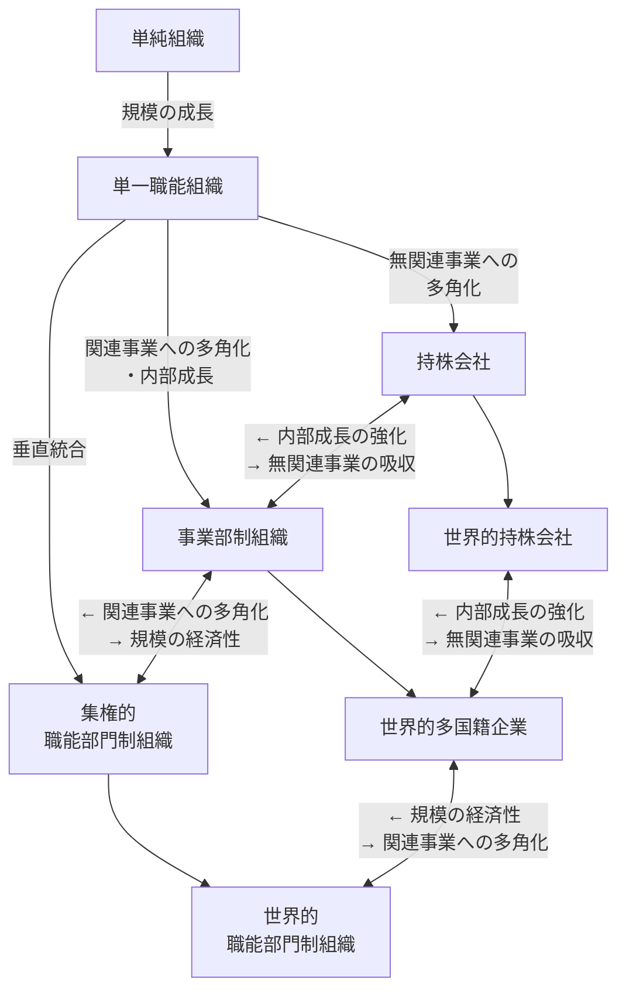

# 組織の発展段階モデル

## 発展段階モデルの要約

## 段階
### 創業時
- 単一の職能と単一の製品ラインだけの「単純組織」からスタートする
### 規模の成長
- 量的な拡大が生じ、分業の必要性が生じ、その分化された仕事を調整するために「単一職能組織」となる
### 垂直統合・関連多角化・無関連多角化
- 供給あるいは流通が重要で、垂直統合を志向する場合、大規模な集権化組織が必要であるので、「集権的職能部門制組織」となる
- 関連事業への多角化戦略によって内部成長を志向する場合、「事業部制組織」となる
- 買収などによって無関連多角化を志向する場合、「持株会社（またはコングロマリット）」となる
※「集権的職能部門制組織」や「持株会社」を経て、「事業部制組織」となる場合もある
※「事業部制組織」から、関連性のある製品ライン間で標準化を図り、規模の経済性を発揮する場合、「集権的職能部門制組織」となる
※「事業部制組織」から、外部成長を追及して、無関連な多角化を図る場合、「持株会社」となる
### 海外への進出
- 海外展開する前段階は、「事業部制組織」「集権的職能部門制組織」「持株会社」である
    - よって、海外進出する際に、それぞれが単純に"世界的"な形に移行すれば、「世界的多国籍企業」「世界的職能部門制組織」「世界的持株会社」となる
- また、「世界的多国籍企業」から「世界的職能部門制組織」や「世界的持株会社」となる、あるいは、世界的職能部門制組織から世界的多国籍企業、世界的持株会社から世界的多国籍企業となるのは、上述した国内組織の場合と同様である