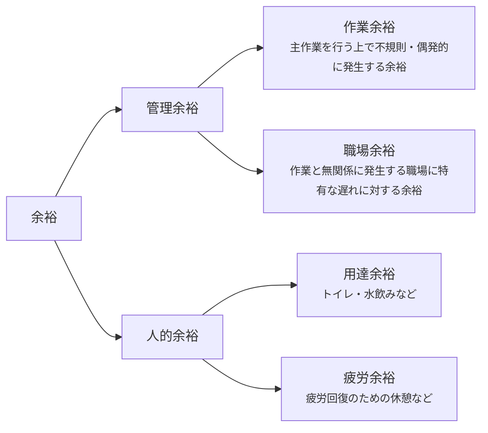

# 標準

## 作業標準

- 製品または部品の各製造工程を対象に、作業条件、作業方法、管理方法、使用材料、使用設備、作業要領などに関する基準を規定したもの

### 補足

- 作業標準の作成に当たっては、最善な作業方法で実行可能で、目的や目標値が具体的であることが重要であり、状況が変化した場合には常に改定されなければならない
- 作業標準を設定する対象は、加工・組立・検査・準備段取作業などの直接作業と運搬・清掃・保全などの間接作業に及ぶ

## 標準時間

- 標準時間とは、「その仕事に適正をもち習熟した作業者が、所定の作業条件のもとで、必要な余裕を持ち、正常な作業ペースによって仕事を遂行するために必要とされる時間」と定義されている
- 生産計画、日程計画、工数計画、原価見積り、作業改善、能率管理などの基準として用いられる
- 単に「実際にかかった時間」ではなく、異常な手待ち、作業ミス、極端に速い・遅い作業ペースなどを除いた管理上の基準時間である

### 標準時間の構成

- 標準時間は、作業そのものに必要な**正味時間**と、避けることのできない中断や疲労回復などを見込んだ**余裕時間**から構成される
- 基本式は、`標準時間 ＝ 正味時間 ＋ 余裕時間`である
- 余裕率を正味時間に対する割合で表す外掛け法では、$標準時間=正味時間×(1＋余裕率)$となる
- 余裕率を標準時間に対する割合で表す内掛け法では、$標準時間=正味時間÷(1－余裕率)$となる

#### 正味時間

- 作業を実際に遂行するために直接必要な時間
- ストップウォッチ法では、観測時間を作業者のペースで補正して求める
- 例えば、観測時間が50秒、レイティング係数が120％であれば、正味時間は$50秒×1.2=60秒$となる

#### 余裕時間

- 作業中に避けられない遅れや、作業者の疲労回復などのために標準時間へ加える時間
- トイレ、水飲み、疲労回復、不規則な作業上の遅れ、職場特有の遅れなどが含まれる

### 標準時間を設定する目的

- 必要人員や必要工数を見積もる
- 生産能力や負荷を把握する
- 作業改善前後の効果を比較する
- 標準原価や加工費を計算する
- 作業者や工程の能率を管理する

### 標準時間を用いる際の注意点

- 作業方法や設備条件が変わった場合は、標準時間も見直す必要がある
- 標準時間が厳しすぎると無理な作業を招き、緩すぎると改善や管理の基準として機能しにくい
- 標準時間は作業者を急がせるための時間ではなく、合理的な作業条件を前提にした管理基準である

### 標準時間の設定法

* 標準時間の設定法は、直接測定法と間接測定法に大別される

#### 直接測定法

* 標準時間の設定にあたり、当該作業を実施・観察し、その測定結果を基に決定する方法

##### 方法例

###### ストップウォッチ法

* 作業を複数の作業要素に分け、実際の作業時間をストップウォッチで複数回測定して、代表時間を求める方法
* 観測時間を作業者の作業ペースで補正するレイティングを行って正味時間を求め、さらに余裕時間を加えて標準時間を設定する
* 計算の基本的な流れは、`観測時間 × レイティング係数 ＝ 正味時間`、`正味時間 ×（1＋余裕率）＝ 標準時間`である。ただし、後者は余裕率を正味時間に対する割合で表す外掛け法の場合である
* 同一作業を反復し、作業方法や作業条件が安定している場合に適している。一方、観測者によるレイティングのばらつきや、観測されている作業者が普段と異なるペースで作業する可能性に注意する
* 例えば、部品1個の組立作業の代表観測時間が50秒、レイティング係数が120％、余裕率が10％である場合、正味時間は`50秒 × 1.2 ＝ 60秒`、標準時間は`60秒 × 1.1 ＝ 66秒`となる

#### 間接測定法

* 標準時間の設定にあたり、当該作業をその場で実施・観察せず、経験、過去の実績、既定の時間値などを用いて設定する方法

##### 方法例

###### 経験見積り法

* 現場経験の豊富な管理者や熟練者が、過去の経験や作業内容に関する知識を基に作業時間を見積もる方法
* 短時間かつ低コストで設定できるため、非反復作業や新規作業の概算に利用しやすい。一方、見積りが担当者の経験や主観に左右され、設定根拠を客観的に説明しにくい
* 例えば、熟練した工場長が、類似製品の段取りに通常20分程度を要するという経験から、設備や材料の違いを考慮して新製品の段取り時間を25分と見積もる

###### 実績測定法

* 過去の作業実績に記録された時間資料を用い、対象作業との類似性や作業条件の違いを考慮して標準時間を見積もる方法
* 多数の実績値から異常値を除き、平均値や中央値などの代表値を求め、必要に応じてロット数、設備、作業方法などの条件差を補正する
* 実績データを活用できるため測定の手間は小さいが、実績値に手待ちや異常作業が含まれている場合や、過去の作業方法が非効率な場合には、それを標準として固定化するおそれがある
* 例えば、類似部品の加工時間の実績が1個当たり平均10分であり、新部品では加工量が20％多いと判断した場合、設備や作業条件が同じであれば、加工時間を`10分 × 1.2 ＝ 12分`と見積もる

###### PTS（Predetermined Time Standard System）法

* 人の作業を手や目、身体などの基本動作に分解し、動作の種類や条件ごとにあらかじめ定められた時間値を合計して正味時間を求める方法
* 実際の作業速度を測定しないため、ストップウォッチ法のようなレイティングを必要とせず、作業方法を設計する段階でも時間を設定できる
* 基本動作への分解や符号化には知識と手間が必要であり、機械の自動運転時間や判断を中心とする作業よりも、人の反復的な手作業に適している
* 例えば、部品を「手を伸ばす→つかむ→運ぶ→位置決めする→手を離す」という基本動作に分解し、それぞれの既定時間値を合計した後、余裕時間を加えて標準時間を設定する

###### MODAPTS（MODular Arrangement of PTS）法

* PTS法の一種で、移動動作と、つかむ・置くなどの終局動作を組み合わせたモジュールによって作業者の動作を分析する方法
* 動作時間はMODという単位で表し、`1 MOD ＝ 0.129秒`として換算する。MTM法より動作分類が簡略化されているため、比較的短時間で分析できる
* 例えば、箱から部品を取り出して治具に置く作業を、「腕を動かす＋つかむ」「腕を動かす＋位置決めする」というモジュールに分解し、各モジュールのMOD値を合計する。合計が20 MODであれば、正味時間は`20 × 0.129秒 ＝ 2.58秒`となる

###### MTM（Methods Time Measurement）法

* 運ぶなどの手の動作、焦点合わせなどの目の動作、および身体動作からなる基本動作を設け、動作の種類、移動距離、目的物の条件、難易度に応じた正味時間値を表から選び、それらを合計して標準時間を求める方法
* 動作時間はTMUという単位で表し、`1 TMU ＝ 0.00001時間 ＝ 0.036秒`として換算する。動作を詳細に分析できる一方、MODAPTS法に比べて分析に時間と熟練を要する
* 例えば、ねじを取って所定位置に置く作業を、「手を伸ばす（Reach）→つかむ（Grasp）→運ぶ（Move）→位置決めする（Position）→手を離す（Release）」に分解する。表から求めた時間値の合計が50 TMUであれば、正味時間は`50 × 0.036秒 ＝ 1.8秒`となる

###### 標準時間資料法

* 過去に測定した作業要素ごとの標準時間を分類・整理し、時間と変動要因との関係を数式、図、表などにまとめた標準時間資料を用いて、新しい作業の標準時間を設定する方法
* 作業要素とその変動要因を資料化しておけば、類似作業の標準時間を迅速かつ一貫した基準で設定できる。一方、作業方法や設備が変化した場合は、資料を更新しなければ精度が低下する
* 例えば、穴あけ作業について、材料の種類、穴の直径、穴の深さごとの標準時間を表にしておく。直径10mm、深さ20mmの穴を4か所加工する新規作業では、表から1か所当たり30秒と読み取り、穴あけ部分の標準時間を`30秒 × 4か所 ＝ 120秒`と設定する

### 余裕

* 作業中に避けることのできない中断や、作業者の疲労回復などを見込んで、正味時間に加える時間
* 標準時間は、正味時間に余裕時間を加えて設定する
* 余裕率を正味時間に対する割合で表す外掛け法の場合、`標準時間 ＝ 正味時間 ×（1＋余裕率）`となる
* 例えば、正味時間が60秒、余裕率が10％の場合、標準時間は`60秒 × 1.1 ＝ 66秒`となる

#### 余裕の分類

