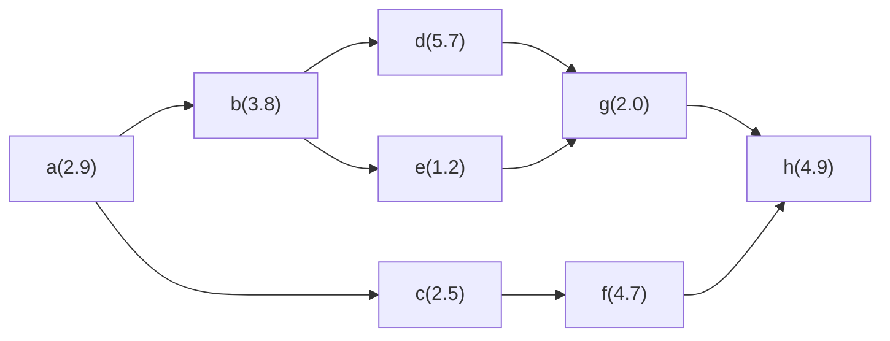

# 計算

## 工程能力

- 定められた規格限度内で製品を生産できる能力のこと（標準偏差）

### 工程能力指数

- 工程能力をを評価する尺度

$$
Cp = \frac{\text{規格幅}}{6\sigma}
$$

※公差：規格の上限値と下限値の差　$\sigma$：標準偏差

#### 例題

規格の上限値：11.80mm　規格の下限値：10.00mm
工程能力指数Cp：1.0
↓
変更後の規格の上限値：11.60mm　変更後規格の下限値：10.16mm

##### 1. 現在の工程能力（長さの標準偏差）の下で規格を変更したときのCpの値

$$
6\sigma=\frac{公差}{Cp}=\frac{11.80-10.00}{1.0}=1.8
$$

$$
\sigma=0.3
$$

$$
変更後のCp=\frac{変更後の規格における公差}{6\sigma}=\frac{11.60-10.16}{1.8}=0.8
$$

∴0.8

##### 2. 規格を変えたときに、工程能力指数Cpを1.2に向上させる施策

変更後の公差=1.44

$$
1.2=\frac{1.44}{6\sigma}
$$

$$
\sigma=\frac{1.44}{6×1.2}=0.20
$$

∴$\sigma$を0.20にする

## 不適合品を手直しして良品として販売する際の人件費

### 各条件

| 月間生産個数 | 不適合率 | 販売価格 | 変動費率 | 不適合品1個当たりの廃棄費用 |
| :----------: | :------: | :------: | :------: | :-------------------------: |
|     1000     |    5%    |  2000円  |   60%   |            700円            |

不適合による追加費用は、人件費以外発生しない

### 計算

#### 現状の限界利益

| 項目     | 計算          | 金額      |
| -------- | ------------- | --------- |
| 売上高   | 2,000×950個  | 1,900,000 |
| 変動費   | 1,200×1000個 | 1,200,000 |
| 廃棄費用 | 700×50個     | 35,000    |
| 限界利益 |               | 665,000   |

#### 全て用品として販売したときの限界利益

| 項目     | 計算           | 金額      |
| -------- | -------------- | --------- |
| 売上高   | 2,000×1,000個 | 2,000,000 |
| 変動費   | 1,200×1000個  | 1,200,000 |
| 限界利益 |                | 80,000    |

よってすべて料品として販売できた場合、$800,000-665,000=135,000円$利益が増えるので、これ未満の人件費であれば、採算が合う

## 人時生産性

各店舗で作業を効率化するためのシステムを導入し、1人当たりの作業時間を変えずに従業員を1人ずつ減らした場合、売上高と粗利高が変わらないとすると、システム導入前と比べて人時生産性で最も改善額が大きい店舗を選べ

### 各条件

|                    | 店舗A | 店舗B | 店舗C | 店舗D |
| :----------------- | ----: | ----: | ----: | ----: |
| 売上高（万円）     |   360 |   400 |   400 |   360 |
| 粗利高（万円）     |   144 |   180 |   144 |   144 |
| 従業員数（人）     |     4 |     4 |     4 |     5 |
| 総作業時間（時間） |   480 |   480 |   480 |   480 |

人時生産性は粗利高で算出するものとする

### 計算

人時生産性とは、従業員1人が1時間当たりにいくらの粗利益を生み出すかを表す指標

$$
\text{人時生産性}=\frac{\text{粗利益}}{\text{総労働時間}}
$$

一般的に人時生産性の改善には、「粗利益の向上」または「総労働時間の削減」が求められる
問題で、粗利益は変わらないとしているので、システム導入により総作業時間の削減を図り、人時生産性を改善している
  条件をもとに現在の人時生産性を算出

|                             | 店舗A | 店舗B | 店舗C | 店舗D |
| :-------------------------- | ----: | ----: | ----: | ----: |
| 粗利高（万円）              |   144 |   180 |   144 |   144 |
| 従業員数（人）              |     4 |     4 |     4 |     5 |
| 総作業時間（時間）          |   480 |   480 |   600 |   600 |
| 1人あたりの作業時間（時間） |   120 |   120 |   150 |   120 |
| 人時生産性（万円）          |   0.3 | 0.375 |  0.24 |  0.24 |

システム導入前後で粗利高、1人当たりの作業時間は変わらないが、従業員数が1人減ることで、従業員数、総作業時間、人時生産性が変化する

システム導入後

|                             | 店舗A |           店舗B | 店舗C | 店舗D |
| :-------------------------- | ----: | --------------: | ----: | ----: |
| 粗利高（万円）              |   144 |             180 |   144 |   144 |
| 従業員数（人）              |     3 |               3 |     3 |     4 |
| 総作業時間（時間）          |   360 |             360 |   450 |   480 |
| 1人あたりの作業時間（時間） |   120 |             120 |   150 |   120 |
| 人時生産性（万円）          |   0.4 |             0.5 |  0.32 |   0.3 |
| 人時生産性の改善額（万円）  |   0.1 | **0.125** |  0.08 |  0.06 |

よって店舗Bが最も改善額が大きい

## 交差比率

最も公差比率の低い分類を選べ

### 条件

|           | 売上高（万円） | 粗利率（%） | 平均在庫額（万円） |
| --------- | -------------: | ----------: | -----------------: |
| 商品分類1 |            180 |        30.0 |                 30 |
| 商品分類2 |            100 |        25.0 |                 50 |
| 商品分類3 |            240 |        10.0 |                 24 |
| 商品分類4 |             80 |        40.0 |                 10 |
| 商品分類5 |            400 |        20.0 |                 40 |

### 計算

交差比率とは、商品在庫投資の管理を売価基準で考えるものであり、販売という側面から商品投下資本の効率性を捉える指標

$$
\text{交差比率}=\frac{売上総利益（粗利益）}{平均商品在庫高（売価）}×100\%
$$

各商品分類の交差比率を求めると以下のようになる

$$
\text{交差比率}=\frac{売上高×粗利率}{平均在庫額}×100\%
$$

|          | 商品分類1 |     商品分類2 | 商品分類3 | 商品分類4 | 商品分類5 |
| -------- | --------: | ------------: | --------: | --------: | --------: |
| 交差比率 |      180% | **50%** |      100% |      320% |      200% |

よって商品分類2が最も小さい

## 移動平均法と指数平滑法の需要予測

### 条件

$t-4$期における各手法の需要予測量を求めよ
平滑化定数は0.8

|                            | $t-4$期 | $t-3$期 | $t-2$期 | $t-1$期 | $t$期 |
| -------------------------- | --------: | --------: | --------: | --------: | ------: |
| 実際の需要量               |        90 |        30 |        60 |        30 |      90 |
| 移動平均法による需要予測量 |        30 |        50 |        50 |        60 |      40 |
| 指数平滑法による需要予測量 |        ※ |        ※ |        ※ |        ※ |      60 |

注：表中の※印は、値の記載を省略している

### 計算

$$
移動平均法による需要予測量=\frac{\sum{（過去の任意の観測値）}}{観測値の個数}
$$

$$
\begin{aligned}平滑指数法による需要予測量&=a×当期の需要実績値+(1-a)×当期の需要予測値\\&=当期の需要予測値+a(当期の需要実績値+当期の需要予測値)\\&=当期の需要予測値+a×当期の予測誤差\end{aligned}
$$

$a$：平滑化指数

$$
\begin{aligned}移動平均法によるt+1期の需要予測量&=\frac{t期の実績値+t-1期の実績値+t-2期の実績値}{3}\\&=\frac{90+30+60}{3}&=60(個)\end{aligned}
$$

$$
\begin{aligned}指数平滑法によるt+1期の需要予測量&=a×t期の需要実績値+(1-a)×t期の需要予測値\\&=0.8×90+(1-0.8)×60&=84(個)\end{aligned}
$$

## 標準時間に関する問題

### 余裕率の計算

#### 正味時間と標準時間で求める方法

##### 内掛け法

- 余裕率を、正味時間に対する割合で表す手法

$$
標準時間=正味時間×(1+余裕率)
$$

$$
余裕率=\frac{標準時間}{正味時間}-1
$$

##### 外掛け法

- 余裕率を、標準時間に対する割合で表す手法

$$
標準時間=\frac{正味時間}{1-余裕率}
$$

$$
余裕率=1-\frac{正味時間}{標準時間}
$$

#### ワークサンプリングの結果で求める方法

##### 内掛け法

$$
余裕率=\frac{余裕回数}{全サンプル数}
$$

##### 外掛け法

$$
余裕率=\frac{余裕回数}{全サンプル数-余裕回数}
$$

### 正味時間の計算

$$
正味時間=\frac{観測時間の代表値×レイティング係数}{100}
$$

## 設備投資案の評価

各投資案の正味現在価値利益$\text{P}_A、\text{P}_B、\text{P}_C$を大きい順に並べたときの順序はどうなるか（投資の計画期間は10年とする）

### 条件

#### 表1 各案の初期投資額、年々の節減額と割引回収期間

| 投資案 | 初期投資額 | 自動化による 年々の経費節減額 | 割引回収期間 |
| :----: | :--------: | :--------------------------------: | :----------: |
|   A   |  1500万円  |             380万円/年             |    4.9年    |
|   B   |  2000万円  |             450万円/年             |    5.7年    |
|   C   |  3500万円  |             700万円/年             |    6.6年    |

#### 表2 追加投資案の割引回収期間

追加投資：安い案から高い案へグレードアップするときに、余分に払う投資額のこと

| 追加投資案 | 初期投資額の差額 | 経費節減額の差額 | 割引回収期間 |
| :--------: | :--------------: | :--------------: | :----------: |
|    B-A    |     500万円     |    70万円/年    |    11.0年    |
|    C-B    |     1500万円     |    250万円/年    |    8.5年    |
|    C-A    |     2000万円     |    320万円/年    |    9.0年    |

### 計算

- 追加投資をするときの差額に対する割引回収期間が10年を超えるのかどうかで考える
  - AからB：割引回収期間は11.0年なので、追加投資しても、それを10年以内に回収できないので、A>B
  - AからC：割引回収期間は9.0年なので、追加投資すると、10年以内に回収できるので、C>A
  - BからC：割引回収期間は8.5年なので、追加投資すると、10年以内に回収できるので、C>B
- よって、$\text{P}_C>\text{P}_A>\text{P}_B$

## 強度率

- 労働時間1000時間あたりの労働損失日数
- その値が小さいほど職場が良好な状態

$$
強度率=\frac{延べ労働損失日数}{延べ実労働時間数}×1000
$$

## 粗利益率、相乗積

### 条件

| 表品カテゴリー |  売上高  | 粗利益率 | 相乗積 |
| :------------: | :------: | :------: | :-----: |
|  カテゴリーA  | 380万円 |  25.0%  | （値1） |
|  カテゴリーB  | 140万円 |  30.0%  |  4.2%  |
|  カテゴリーC  |  90万円  |  40.0%  | （値2） |
|  カテゴリーD  | 240万円 | （値3） |  4.8%  |
|  カテゴリーE  | 150万円 |  12.0%  |  1.8%  |
|      全体      | 1000万円 |  23.9%  |        |

### 計算

$$
\begin{aligned}相乗積&=各カテゴリーの売上構成比×各カテゴリーの粗利益率\\&=\frac{各カテゴリーの売上高}{全体の売上高}×各カテゴリーの粗利益率\end{aligned}
$$

$$
粗利益高=売上高×粗利益率
$$

すべて計算すると以下のようになる

| 表品カテゴリー |  売上高  | 粗利益率 | 相乗積 | 売り上げ構成比 | 粗利益高 |
| :------------: | :------: | :------: | :-----: | :------------: | :------: |
|  カテゴリーA  | 380万円 |  25.0%  | （値1） |     38.0%     |  95万円  |
|  カテゴリーB  | 140万円 |  30.0%  |  4.2%  |     14.0%     |  42万円  |
|  カテゴリーC  |  90万円  |  40.0%  | （値2） |      9.0%      |  36万円  |
|  カテゴリーD  | 240万円 | （値3） |  4.8%  |     24.0%     |  48万円  |
|  カテゴリーE  | 150万円 |  12.0%  |  1.8%  |     15.0%     |  18万円  |
|      全体      | 1000万円 |  23.9%  |        |      100%      | 239万円 |

### 補足

- カテゴリーAの粗利益率は全体の粗利益率よりも高く、取り扱いをやめると、全体の粗利益率は低下する
- カテゴリーBの粗利益率は全体の粗利益率よりも高く、売上高が2倍になると、全体の粗利益率は上昇する
- カテゴリーCの売上高が2倍になった場合、粗利益高の増加額は36万円であり、カテゴリーBの売上高が2倍になった場合、粗利益高の増加額は42万円
  - 全体の粗利益高の増加額は大きくなるのは、カテゴリーBの売上高が2倍になった時
- カテゴリーDの粗利益率は全体の粗利益率よりも低く、売上高が半分になると全体の粗利益率は上昇する
- カテゴリーEの売上高が10倍となるとカテゴリーEの粗利益高も10倍になり180万円となる
  - 全体の粗利益高は、$95+42+36+48+180=401万円$となるが、この時、元の粗利益高239万円の約1.7倍であり、2倍以上にならない

## 併売分析

### 条件

サイトを訪れた人数の合計は144人

| 商品 | 購買者数（人） |
| :---: | :------------: |
| Aのみ |       26       |
| Bのみ |       14       |
| AとB |       10       |
| Cのみ |       18       |
| Dのみ |       26       |
| CとD |       8       |

### 計算

#### 支持度（サポート）

- 全顧客人数のうち特定の商品、または特定の商品の組み合わせを購入した人数の割合

$$
\begin{aligned}商品\text{A}の支持度&=\frac{商品\text{A}を購買した顧客数}{全顧客数}\\&=\frac{\text{Aのみ購入した人数}+\text{AとBを購入した人数}}{144}\\&=\frac{26+10}{144}=0.25\end{aligned}
$$

#### 信頼度（コンフィデンス）

- ある特定商品を購買した人の中でもう1つの商品を同時購買した人数の割合

$$
\begin{aligned}\text{信頼度（商品A→商品B）}&=\frac{\text{商品Aおよび商品Bを購買した顧客数}}{\text{商品Aを購買した顧客数}}\\&=\frac{10}{36}=0.277・・・\end{aligned}
$$

#### ジャッカード係数

- 2つの集合の類似度を評価する指標

$$
\begin{aligned}\text{商品Aと商品Bのジャッカード係数}&=\frac{\text{商品Aおよび商品Bを購買した顧客数}}{\text{商品Aまたは商品Bを購買した顧客数}}\\&=\frac{10}{26+14+10}=0.2\end{aligned}
$$

#### リフト値

- もともとの特定商品の購買率に対して、ある商品との同時購買率の大きさを表す指標
- リフト値（商品A→商品B）とは、「商品Aを購買した人のうち商品Bを購買した人の割合」（分子）が「全顧客数のうち商品Bを購入した人の割合」（分母）の何倍になるのかを示した値
  - リフト値（商品A→商品B）とリフト値（商品B→商品A）は同じ値になる

$$
\begin{aligned}\text{リフト値（商品A→商品B）}&=\frac{\frac{\text{商品Aおよび商品Bを購買した顧客数}}{\text{商品Aを購買した顧客数}}}{\frac{\text{商品Bを購買した顧客数}}{\text{全顧客数}}}\\&=\frac{\text{信頼度（商品A→商品B）}}{商品\text{B}の支持度}\\
&=\frac{\frac{10}{36}}{\frac{24}{144}}=\frac{10}{36}×\frac{144}{24}=\frac{5}{3}
\end{aligned}
$$

## ライン生産

### 条件

- 稼働予定時間700時間、目標生産計画量5900個
- 設定サイクルタイムは分単位の整数値

※括弧内は要素作業時間（分）

### 計算

#### サイクルタイム

$$
\begin{aligned}
サイクルタイム（分）&=\frac{生産期間}{\text{(生産期間中の)生産量}}\\&=\frac{\text{700(時間)}×\text{60(分/時間)}}{5900(個)}=7.1・・・≒7（分）\end{aligned}
$$

#### 要素作業の割り当て

##### 考慮すべき条件

1. 先行関係が適切であること（工程順が逆になっていないこと）
2. 全体の作業時間を確保できる工程数であること（最小作業工程数を充たしていること）
3. 各工程の所要時間がサイクルタイム7分以下であること

##### 最小作業工程数

$$
\begin{aligned}最小作業工程数&=\frac{各作業の所要時間合計}{サイクルタイム}\\
&=\frac{2.9+3.8+2.5+5.7+1.2+4.7+2.0+4.9(=27.7)(分)}{7(分)}=3.9・・・\end{aligned}
$$

最小作業工程数は切り上げた整数となるため、4となる

## ジョンソン法

### 条件

|      | 第1工程 | 第2工程 |
| :---: | :-----: | :-----: |
| 製品A |    1    |    4    |
| 製品B |    5    |    2    |
| 製品C |    5    |    6    |
| 製品D |    8    |    4    |

### 順序決定の手順

1. すべての製品の作業の中で加工時間が最小なのは、製品Aの第1工程(1)

- 第1工程（前工程）に最小時間が来ているので、製品Aは最初に着手する

2. 残った製品の作業の中で加工時間が最小なのは、製品Bの第2工程(2)

- 第2工程（後工程）に最小時間が来ているので、製品Bは最後に着手する

3. 残った製品の作業の中で加工時間が最小なのは、製品Dの第2工程

- 第2工程（後工程）に最初時間が来ているので、製品Dはなるべく後（今回の場合3番目）に着手する

4. 残った製品Cが残った順序である2番目の着手となる
   よって、A→C→D→B

### 非稼働時間

- 決定した順序からガントチャートを作成する
  その結果、非稼働時間は、計4回、合計5

## 設備総合効率

- 以下の改善施策を期待させる設備総合効率の高い順に並べる

1. 不適合の原因を検討して、不適合率を20%から15%にする
2. 速度低下の原因を改善して、加工数量を6720個から7680個にする
3. 段取作業を改善して、停止時間を半減させ、稼働時間を800時間から900時間にする

### 条件

負荷時間：1000時間

| 指標                       |  数値  |
| -------------------------- | :-----: |
| 基準サイクルタイム         | 5分/個 |
| 稼働時間                   | 800時間 |
| 加工数量（不適合品を含む） | 6720個 |
| 不適合率                   |   20%   |

### 計算

$$
\begin{aligned}\text{設備総合効率}&=\text{時間稼働率}×\text{性能稼働率}×\text{良品率}\\&=\frac{稼働時間}{負荷時間}×\frac{基準サイクルタイム×加工数量}{稼働時間}×\frac{良品数量}{加工数量}\\&=\frac{基準サイクルタイム×良品数量}{負荷時間} \\\end{aligned}
$$

※稼働時間がないため、3つ目の式は使用しない方がよいことがある

#### 現在の設備総合稼働率

$$
\begin{aligned}\text{設備総合効率}&=\frac{稼働時間}{負荷時間}×\frac{基準サイクルタイム×加工数量}{稼働時間}×\frac{良品数量}{加工数量}\\&=\frac{800}{1000}×\frac{5×6720}{800×60}×(1-0.2)\\&=0.448\end{aligned}
$$

#### 1の改善を行った場合の設備総合効率

$$
\begin{aligned}\text{設備総合効率}&=\frac{800}{1000}×\frac{5×6720}{800×60}×(1-0.15)&=0.476\end{aligned}
$$

### 1の改善を行った場合の設備総合効率

$$
\begin{aligned}\text{設備総合効率}&=\frac{800}{1000}×\frac{5×7680}{800×60}×(1-0.2)&=0.512\end{aligned}
$$

#### 1の改善を行った場合の設備総合効率

$$
\begin{aligned}\text{設備総合効率}&=\frac{900}{1000}×\frac{5×6720}{800×60}×(1-0.2)\\&=0.504\end{aligned}
$$

### 結果

2→3→1の順

## ライリーの法則（小売引力の法則）

* A市とB市がX町から吸引する購買力の比率を求める

### 条件

| 市 |  人口  | X町からの距離 |
| :-: | :----: | :-----------: |
| A | 20万人 |     12km     |
| B | 5万人 |      6km      |

### 計算
- 2つの都市の間にある都市から販売額（顧客）を吸引する場合は、その2つの都市の人口に比例し、距離の2乗に反比例するというもの
$$
\frac{都市\text{A}に吸収される販売額の割合}{都市\text{B}に吸収される販売額の割合}=\frac{都市\text{A}の人口}{都市\text{B}の人口}×\left(\frac{都市\text{B}の人口}{都市\text{A}の人口}\right)^2
$$
$$
\begin{aligned}\frac{都市\text{A}に吸収される販売額の割合}{都市\text{B}に吸収される販売額の割合}&=\frac{20}{5}×\left(\frac{6}{12}\right)^2\\&=\frac{1}{1}\end{aligned}
$$
- よって購買力の比率は$1:1$