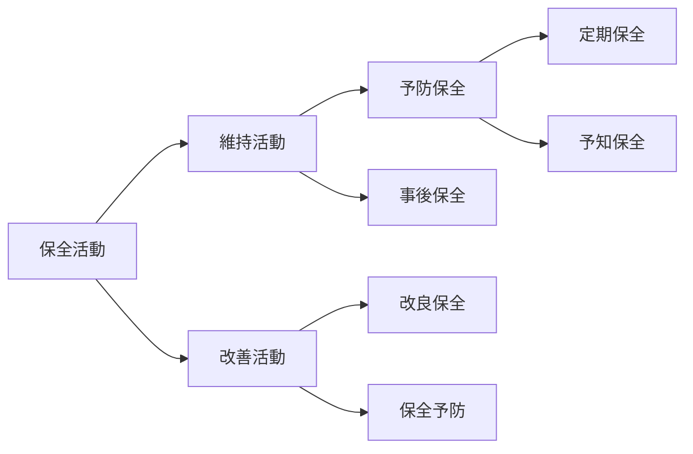

# 設備管理
## 設備の故障
- 設備が次のいずれかの状態になる変化
    1. 規定の機能を失う
    2. 規定の性能を満たせなくなる
    3. 設備による算出物または作用が規定の品質レベルに達しなくなる

## 保全活動

### 各項目について
#### 事後保全
- 予め代替機を用意し、故障してから修理したほうがコストを抑えられる場合に選択する
#### 予防保全
-
### 改善活動
#### キーワード
##### 解析用管理図
- 既に集められた観測値によって、工程が統計的管理状態であるかどうかを評価するための管理図
##### ECRSの原則
- 工程、作業、動作を対象とした改善の指針、着眼点を示したもの
##### U字ライン
- 作業者はU字の内側に配置されるため、移動することなく、もしくは短い移動距離で複数工程の作業が可能となる
- 1人で複数の作業工程を担当することにより、作業の所要時間や作業者間での作業速度の違いを考慮した、効率の良い作業割り当てが可能となる
##### フールプルーフ
- 人為的に不適切な行為、過失などが起こってもシステムの信頼性および安全性を保持する性質
- 作業者が間違ってもそれを防止できるように工夫された仕組み
- 近い意味合いでフェイルセーフがあるが、これは「故障時に、安全性を保つことが出来るシステムの性質」であり、設備の故障後の安全性を考慮した仕組み
#### 補足
- 運搬ロットサイズを削減すると、1回の運搬量が減少するため、運搬回数は増加する

## 設備総合効率
- 設備の使用効率の度合を表す指標
- 当該設備の操業時間のうち、付加価値を創出している時間がどれだけ占めているかを表す指標
$$
\text{設備総合効率}=\text{時間稼働率}×\text{性能稼働率}×\text{良品率}
$$

## 設備の7大ロス
- 設備の効率化を阻害するロスで、「①故障、②段取・調整、③刃具交換、④立ち上がり、⑤チョコ停・空転、⑥速度低下、⑦不良・手直し」の7つを指す

## 設備の可用率
- 要求通りに遂行できる状態にあるアイテムの能力
$$
\text{可用率}=\frac{MTBF}{MTBF\text{（平均故障間動作時間）}+MTTR\text{（平均修復時間）}}
$$
