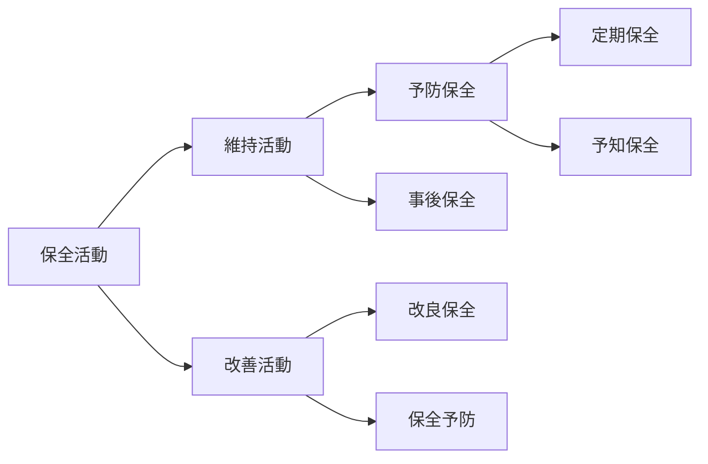

# 設備管理
## 設備の故障
- 設備が次のいずれかの状態になる変化
    1. 規定の機能を失う
    2. 規定の性能を満たせなくなる
    3. 設備による算出物または作用が規定の品質レベルに達しなくなる

## 保全活動

## 設備総合効率
- 設備の使用効率の度合を表す指標
- 当該設備の操業時間のうち、付加価値を創出している時間がどれだけ占めているかを表す指標
$$
\text{設備総合効率}=\text{時間稼働率}×\text{性能稼働率}×\text{良品率}
$$

## 設備の7大ロス
- 設備の効率化を阻害するロスで、「①故障、②段取・調整、③刃具交換、④立ち上がり、⑤チョコ停・空転、⑥速度低下、⑦不良・手直し」の7つを指す

## 設備の可用率
- 要求通りに遂行できる状態にあるアイテムの能力
$$
\text{可用率}=\frac{MTBF}{MTBF\text{（平均故障間動作時間）}+MTTR\text{（平均修復時間）}}
$$