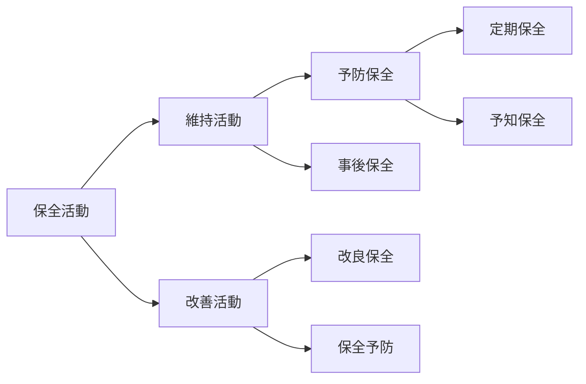

# 設備管理

## 設備の故障

- 設備が次のいずれかの状態になる変化
  1. 規定の機能を失う
  2. 規定の性能を満たせなくなる
  3. 設備による算出物または作用が規定の品質レベルに達しなくなる

## 保全活動

### 各項目について

#### 事後保全

- フォールト検出後、アイテムを要求通りの実行状態に修復させるために行う保全
- 予め代替機を用意し、故障してから修理したほうがコストを抑えられる場合に選択する

#### 予防保全

- アイテムの劣化の影響を緩和し、かつ、故障の発生確率を低減するために行う保全
- 清掃、給油、増し締めなどの活動が含まれる

##### 予知保全（状態監視保全）

- 設備の劣化傾向を設備診断技術などによって管理し、古書に至る前の最適な時期に最善の対策を行う予防保全

#### 改良保全

- 過去に発生した故障が再発しないように改善を加える活動

### 改善活動

#### キーワード

##### 5W1H

- 5W1Hのはじめの問いかけは「What・Why」(その仕事はなぜ必要か？)

##### 解析用管理図

- 既に集められた観測値によって、工程が統計的管理状態であるかどうかを評価するための管理図

##### ECRSの原則

- 工程、作業、動作を対象とした改善の指針、着眼点を示したもの

|    文字    |   英語   | 日本語                                 |
| :---------: | :-------: | -------------------------------------- |
| **E** | Eliminate | 排除（なくせないか？）                 |
| **C** |  Combine  | 結合（まとめられないか？）             |
| **R** | Rearrange | 交換・再編成（順序を変えられないか？） |
| **S** | Simplify | 簡素化（単純にできないか？）           |

- この順番自体に優先順位の意味があり、E→C→R→Sの順で改善を検討する

##### U字ライン

- 作業者はU字の内側に配置されるため、移動することなく、もしくは短い移動距離で複数工程の作業が可能となる
- 1人で複数の作業工程を担当することにより、作業の所要時間や作業者間での作業速度の違いを考慮した、効率の良い作業割り当てが可能となる

##### フールプルーフ

- 人為的に不適切な行為、過失などが起こってもシステムの信頼性および安全性を保持する性質
- 作業者が間違ってもそれを防止できるように工夫された仕組み
- 近い意味合いでフェイルセーフがあるが、これは「故障時に、安全性を保つことが出来るシステムの性質」であり、設備の故障後の安全性を考慮した仕組み

#### 補足

- 運搬ロットサイズを削減すると、1回の運搬量が減少するため、運搬回数は増加する

## 設備総合効率

- 設備の使用効率の度合を表す指標
- 当該設備の操業時間のうち、付加価値を創出している時間がどれだけ占めているかを表す指標

$$
\begin{aligned}\text{設備総合効率}&=\text{時間稼働率}×\text{性能稼働率}×\text{良品率}\\&=\frac{稼働時間}{負荷時間}×\frac{基準サイクルタイム×加工数量}{稼働時間}×\frac{良品数量}{加工数量}\\&=\frac{基準サイクルタイム×良品数量}{負荷時間}\end{aligned}
$$

## 設備の7大ロス

- 設備の効率化を阻害するロスで、「①故障、②段取・調整、③刃具交換、④立ち上がり、⑤空転・チョコ停、⑥速度低下、⑦不良・手直し」の7つを指す

### 設備総合効率との関係

- それぞれ以下の指標に影響している
  - 時間稼働率：故障、段取・調整、刃具交換、立ち上がり
  - 性能稼働率：空転・チョコ停、速度低下
  - 良品率：不良・手直し

## 設備の可用率

- 要求通りに遂行できる状態にあるアイテムの能力

$$
\text{可用率}=\frac{MTBF}{MTBF\text{（平均故障間動作時間）}+MTTR\text{（平均修復時間）}}
$$

## TPM（Total Productive maintenance）

- 全員参加の生産保全

### 定義

1. 生産システム効率化の極限追及（総合的効率化）する企業体質づくりを目標にして、
2. 生産システムのライフサイクル全体を対象とした"災害ゼロ・不良ゼロ・故障ゼロ"などあらゆるロスを未然防止する仕組みを現場現物で構築し、
3. 生産部門をはじめ、開発、営業、管理などのあらゆる部門にわたって、
4. トップから第一線従業員に至るまで全員が参加し、
5. 重複小集団活動により、ロス・ゼロを達成すること

### 自主保全

- 作業員一人ひとりが自分の使っている設備の維持、管理を行い、正しい運転を全員参加で行う活動

#### 目的

- 設備においては故障の減少、不良品の発生削減、安定した稼働の実現、故障しにくい設備への改善等
- また人においては作業員のスキルアップ、モチベーションアップ等である

#### 自主保全の7つのステップ

| ステップ | 名称                 | 活動内容                                                                                                                                                           |
| :------: | -------------------- | ------------------------------------------------------------------------------------------------------------------------------------------------------------------ |
|   第1   | 初期清掃             | 設備本体を中心とするゴミ・汚れの一斉清掃と給油、増締めの実施および設備の不具合発見とその復元                                                                       |
|   第2   | 発生源・困難箇所対策 | ゴミ・汚れの発生源、飛散の防止や清掃・給油、増締め、点検の困難箇所を改善し、清掃・点検の時間短縮を図る                                                             |
|   第3   | 自主保全仮基準の作成 | 短期間で清掃・給油・増締めを確実に維持できるように行動基準を作成する（日常、定期に使用できる時間枠を示してやることが必要）                                         |
|   第4   | 総点検               | 点検マニュアルによる点検技能教育と総点検実施による設備微欠陥摘出と復元                                                                                             |
|   第5   | 自主点検             | 自主点検チェック・シートの作成・実施                                                                                                                               |
|   第6   | 標準化               | 各種の現場管理項目の標準化を行い、維持管理の完全システム化を図る ●清掃給油点検基準 ●現場の物流基準 ●データ記録の標準化 ●型治具管理基準など |
|   第7   | 自主管理の徹底       | 会社法審・目標の展開と、改善活動の定常化 MTBF分析記録を確実に行い、解析して設備改善を行う                                                                     |

#### ポイント

- 清掃、給油、増し締めの3項目は、第1ステップで実施される自主保全であり設備劣化を防ぐための基本条件

  - これらはすべての活動のベースになるもの
  - 点検は第4ステップで実施される
- 設備の劣化には、設備を正しく使用していても経年により発生する**自然劣化**と設備に対してやるべきことを怠って人為的に劣化を促進させる**強制劣化**がある

  - 自主保全は、設備を使用するオペレーター自身が保全活動を行って、強制劣化を抑制する活動
  - 自然劣化の抑制は困難であるため、自然劣化の進行に気づいて強度が限界を下回る前にその部位を復元し、設備の故障を防ぐ
- TPMのPMは生産保全（Productive maintenance）のことであり、事後保全、予防保全、改良保全、保全予防の4つの保全活動を含んでいる

  - この生産保全を全員で進めることからTPM（Total Productive maintenance）と呼ばれている
- TPMでは、日常保全（掃除・給油・増し締め・点検等）はオペレーターが担当し、設備の検査（診断）や修理は保全部門が担当する

